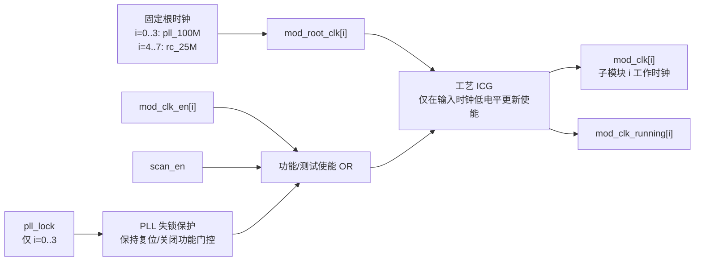
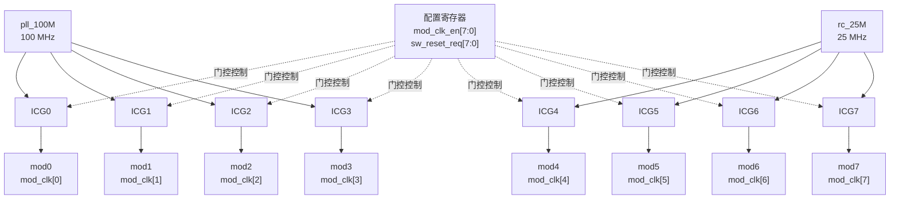
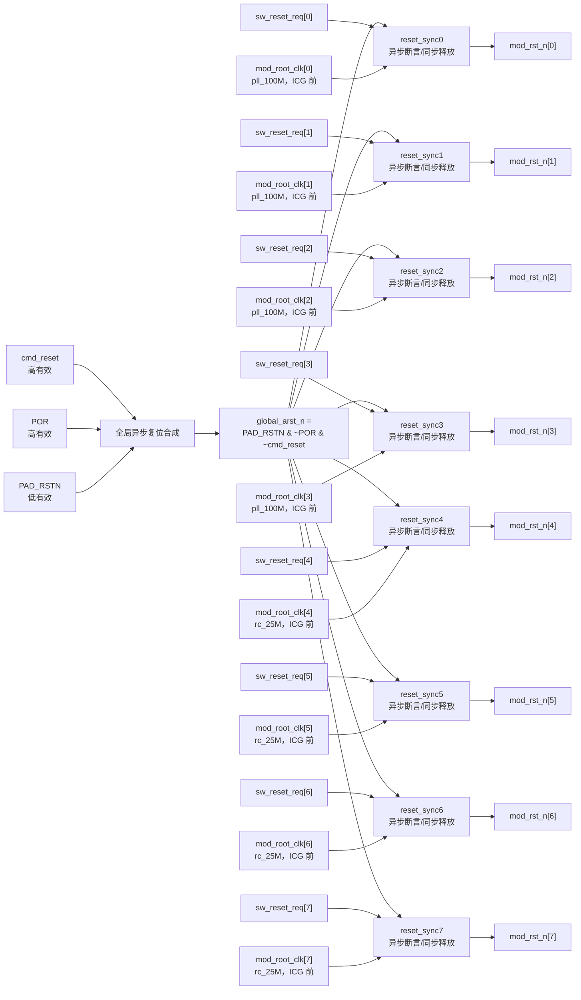
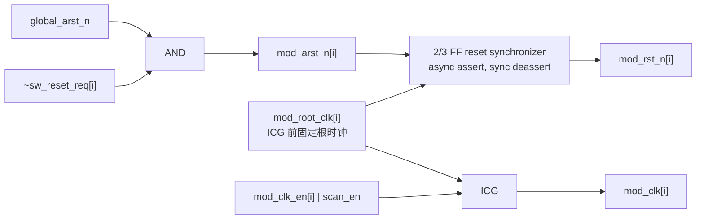

# CRGU：双时钟源、三复位源、八子模块端口与时钟/复位图

## 1. 设计约定

本方案面向一个含 8 个子模块的 CRGU，具备两个候选时钟源和三个全局复位源。

| 信号 | 极性/频率 | 定义 |
| --- | --- | --- |
| `pll_100M` | 时钟，100 MHz | PLL 输出的主高频时钟源；选择前应已由 `pll_lock` 确认稳定 |
| `rc_25M` | 时钟，25 MHz | RC 振荡器或低功耗/备用时钟源 |
| `cmd_reset` | 高有效 | 命令、看门狗或软件上层发起的全局异步复位请求 |
| `POR` | 高有效 | 上电复位（Power-On Reset） |
| `PAD_RSTN` | 低有效 | PAD 外部复位输入（active-low） |
| `sw_reset_req[7:0]` | 高有效 | 各子模块独立的软件复位请求 |

### 1.1 复位合成规则

全局异步复位内部统一为低有效：

```text
global_arst_n = PAD_RSTN & ~POR & ~cmd_reset
```

即任一条件满足时立即断言所有模块的全局复位：

```text
cmd_reset = 1  -> 全局复位断言
POR       = 1  -> 全局复位断言
PAD_RSTN  = 0  -> 全局复位断言
```

假设 `cmd_reset` 和 `POR` 都是异步复位源。若芯片定义中 `POR` 为低有效，只需将上述逻辑改为：

```text
global_arst_n = PAD_RSTN & POR_N & ~cmd_reset
```

### 1.2 时钟策略

时钟源固定分配，不实现动态时钟 MUX：

```text
mod_clk[0] ~ mod_clk[3]：使用 pll_100M（100 MHz）
mod_clk[4] ~ mod_clk[7]：使用 rc_25M （25 MHz）
```

每个模块时钟仍可独立门控。`mod_clk_en[i]` 必须通过 ICG 单元控制，`scan_en=1` 时强制打开门控。`pll_lock` 用于保护 0～3 号模块：PLL 未锁定或失锁时，CRGU 应对这些模块保持复位并关闭功能门控，避免不稳定时钟进入子模块。

## 2. 建议顶层模块端口

使用 8-bit 向量表达八个结构一致的子模块，位 `i` 对应 `mod_i`。若项目命名已固定，可在 `crgu_top` 外另加命名 wrapper。

```systemverilog
module crgu_2clk_8mod (
  // --------------------------------------------------------------------------
  // 时钟源
  // --------------------------------------------------------------------------
  input  logic        pll_100M,       // 100 MHz PLL clock
  input  logic        pll_lock,       // PLL clock valid / locked indication
  input  logic        rc_25M,         // 25 MHz RC clock; assumed always available

  // --------------------------------------------------------------------------
  // 全局异步复位源
  // cmd_reset, POR: active-high; PAD_RSTN: active-low
  // --------------------------------------------------------------------------
  input  logic        cmd_reset,
  input  logic        POR,
  input  logic        PAD_RSTN,

  // --------------------------------------------------------------------------
  // CRGU 控制（来自 APB/AHB/寄存器域时，内部必须做 CDC/握手）
  // --------------------------------------------------------------------------
  input  logic [7:0]  mod_clk_en,     // 1: open functional clock gate
  input  logic [7:0]  sw_reset_req,   // 1: assert local software reset
  input  logic        scan_en,        // DFT: force ICG gates open

  // --------------------------------------------------------------------------
  // 八个子模块时钟与复位
  // 每一位 i 对应子模块 mod_i
  // --------------------------------------------------------------------------
  output logic [7:0]  mod_clk,
  output logic [7:0]  mod_rst_n,      // async assert, sync deassert; active-low

  // --------------------------------------------------------------------------
  // 可选状态/错误上报
  // --------------------------------------------------------------------------
  output logic [7:0]  mod_clk_running
);
```

### 2.1 端口语义

| 端口 | 宽度 | 方向 | 语义 |
| --- | ---: | --- | --- |
| `pll_100M` | 1 | 输入 | PLL 主时钟，供性能模式使用 |
| `pll_lock` | 1 | 输入 | PLL 锁定指示；`0` 时 0～3 号模块保持复位并停止功能时钟 |
| `rc_25M` | 1 | 输入 | RC 时钟，供低功耗/备用模式使用 |
| `cmd_reset` | 1 | 输入 | 高有效全局异步复位请求 |
| `POR` | 1 | 输入 | 高有效上电异步复位 |
| `PAD_RSTN` | 1 | 输入 | 低有效 PAD 异步复位 |
| `mod_clk_en` | 8 | 输入 | 每模块功能门控请求；1 表示允许时钟通过 ICG |
| `sw_reset_req` | 8 | 输入 | 每模块软件复位请求；1 表示仅复位该模块 |
| `scan_en` | 1 | 输入 | DFT 测试使能，旁路功能门控 |
| `mod_clk` | 8 | 输出 | 八路门控后的模块时钟 |
| `mod_rst_n` | 8 | 输出 | 八路模块复位，低有效、异步断言、同步释放 |
| `mod_clk_running` | 8 | 输出 | 建议报告门控/启动状态，不直接采样高速时钟 |

### 2.2 命名映射

| 向量位 | 建议语义 | 时钟端口 | 复位端口 |
| ---: | --- | --- | --- |
| 0 | 子模块 0 | `mod_clk[0]` | `mod_rst_n[0]` |
| 1 | 子模块 1 | `mod_clk[1]` | `mod_rst_n[1]` |
| 2 | 子模块 2 | `mod_clk[2]` | `mod_rst_n[2]` |
| 3 | 子模块 3 | `mod_clk[3]` | `mod_rst_n[3]` |
| 4 | 子模块 4 | `mod_clk[4]` | `mod_rst_n[4]` |
| 5 | 子模块 5 | `mod_clk[5]` | `mod_rst_n[5]` |
| 6 | 子模块 6 | `mod_clk[6]` | `mod_rst_n[6]` |
| 7 | 子模块 7 | `mod_clk[7]` | `mod_rst_n[7]` |

如模块名已知，可将向量端口在 wrapper 中展开，例如 `uart_clk=mod_clk[0]`、`dma_rst_n=mod_rst_n[3]`。CRGU 核心仍建议使用向量化实现，便于参数化、验证和寄存器映射。

固定时钟映射如下：

| 子模块 | 根时钟 | 输出时钟 |
| --- | --- | --- |
| `mod0`～`mod3` | `pll_100M`（100 MHz） | 经各自 ICG 后的 `mod_clk[0]`～`mod_clk[3]` |
| `mod4`～`mod7` | `rc_25M`（25 MHz） | 经各自 ICG 后的 `mod_clk[4]`～`mod_clk[7]` |

## 3. 时钟图

### 3.1 单模块时钟生成路径

时钟源固定连接。`ICG` 必须是工艺库时钟门控单元；本设计不存在运行时源切换，因此不需要 Clock MUX。



### 3.2 八模块时钟分发图



## 4. 复位图

### 4.1 全局复位与每模块本地软件复位

每个模块均有独立的 `reset_sync[i]`。全局异步复位或该模块的软件复位请求到来时，应立即将 `mod_rst_n[i]` 拉低；释放必须在该模块关联的时钟域内同步进行。



### 4.2 单模块复位逻辑

对模块 `i`，建议定义本地异步复位输入：

```text
mod_arst_n[i] = global_arst_n & ~sw_reset_req[i]
```

再经该模块的复位同步器产生输出：

```text
mod_rst_n[i] = reset_sync(
    clk    = reset_release_clk[i],
    arst_n = mod_arst_n[i]
)
```

`reset_release_clk[i]` 推荐使用 **ICG 前的未门控根时钟**，记为 `mod_root_clk[i]`。其中 `mod_root_clk[0:3]=pll_100M`、`mod_root_clk[4:7]=rc_25M`。这能保证即使 `mod_clk_en[i]=0`，本地复位同步器仍有时钟完成同步释放。


